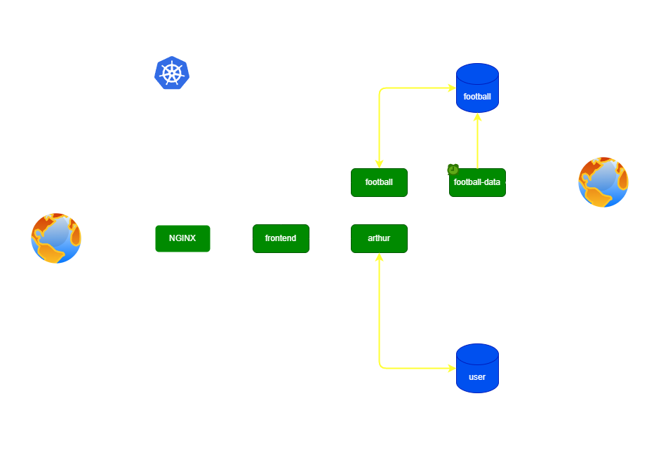
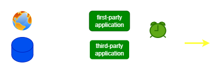

### ***ACME PORTAL COMPANY - TECHNICAL DOCUMENT 001***

#### ***Deployments***

<div align="center">
     
     
</div>

<br/>
<br/>

---

---
<br/>

### ***FRONTEND*** (deployment)
```
Go, LabStack Echo, HTMX, Tailwind CSS

User interface for the ACME Portal Company web application. Uses LabStack Echo as a
web server and router.
```
### ***PANOPTICON*** (deployment)
```
Java, Spring Boot

Backend application responsible for all tasks related to user creation and 
authentication
```
### ***FOOTBALL*** (deployment)
```
Java, Spring Boot

Backend application responsible for retrieval of football data from user-created 
queries, retrieving + persisting queries saved by the user, and generation of data
file exports from query results
```
### ***FOOTBALL DATA*** (cronjob)
```
Go

Job for retrieval, ingestion, and maintenance of football data 
```