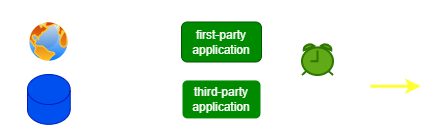

### ***ACME PORTAL COMPANY - TECHNICAL DOCUMENTATION***
---

<div align="center">
     
     
</div>
<br/>
<br/>


---

### ***FRONTEND*** (deployment)
```
Go, LabStack Echo, HTMX, Tailwind CSS
```
### ***PANOPTICON*** (deployment)
```
Java, Spring Boot

A backend application responsible for all tasks related to user creation and authentication
```
### ***FOOTBALL*** (deployment)
```
Java, Spring Boot

A backend application responsible for retrieval of football data from user-created queries, retrieving + persisting queries saved by the user, and generation of data file exports from query results
```
### ***FOOTBALL DATA*** (cronjob)
```
Go

A job for retrieval, ingestion, and maintenance of football data 
```